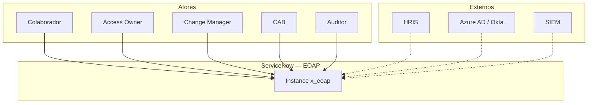
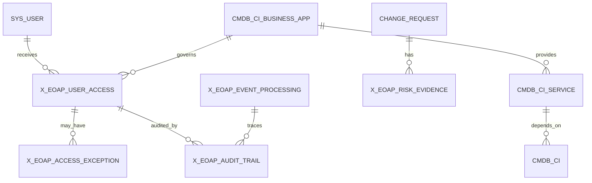
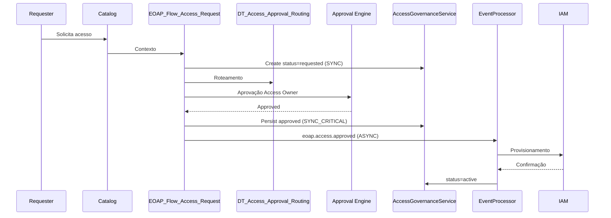
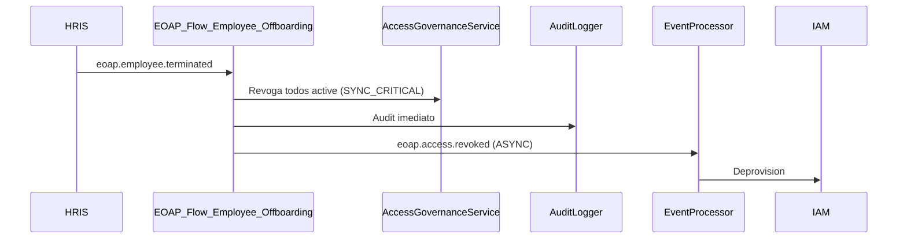
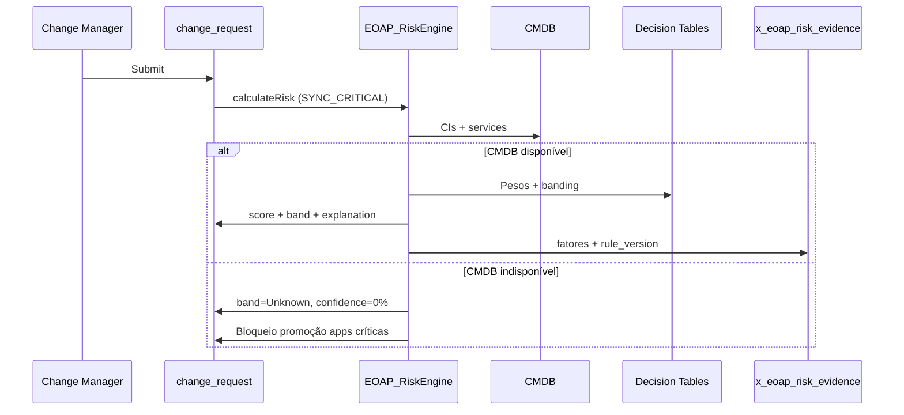

# EOAP — Enterprise Operations Automation Platform
## Documento de Arquitetura Consolidado — Versão Final ARB

| Atributo | Valor |
| --- | --- |
| Documento | Enterprise Architecture — Consolidated Final |
| Solução | EOAP v3.0 |
| Plataforma | ServiceNow — Scoped Application `x_eoap` |
| Autor | Artur Campos Batista |
| Data | 2026-06-06 |
| Versão | 3.0 Final |
| Status | **Aprovado — Architecture Review Board** |
| Classificação | Confidencial — Uso corporativo |
| Consolida | EOAP_ADD_v2.md · EOAP_SDD_v2.md · EOAP_ARCHITECTURE_Portfolio_Final.md |

> Documento único de arquitetura. Substitui as três fontes para fins de ARB, CIO/CTO e implantação enterprise. Detalhe de sprint permanece no Implementation Guide.

---

## A. Executive Summary

### A.1 Problema

Organizações enterprise com ServiceNow operam quatro domínios em silos:

| Domínio | Sintoma | Impacto |
| --- | --- | --- |
| CMDB/CSDM | Inventário passivo, sem ownership nem qualidade | Decisões baseadas em dados incorretos |
| Employee Lifecycle | Onboarding/offboarding manual ou parcial | Acessos órfãos pós-desligamento |
| Access Governance | Tickets sem lifecycle, validade ou recertificação | Falha em auditoria SOX/ISO 27001 |
| Change Risk | CAB sem contexto de dependência ou histórico | Mudanças em produção sem governança objetiva |

Evidências de decisão dispersas em logs, comentários e aprovações isoladas impedem defesa perante auditores e reguladores.

### A.2 Solução

A **EOAP (Enterprise Operations Automation Platform)** é uma camada de **governança operacional** sobre ServiceNow. Unifica CMDB/CSDM, Employee Lifecycle, Access Governance e Change Risk sem substituir ITSM, CMDB, Catalog ou Security nativos.

| Pilar | Função |
| --- | --- |
| CMDB Foundation | Base confiável de Business Applications e Application Services (CSDM 5) |
| Employee Lifecycle | Orquestração joiner/mover/leaver com rastreabilidade |
| Access Governance | Entitlements como objetos governados com owner, validade e recertificação |
| Change Risk Guardian | Score explicável, versionado e defensável perante CAB |

**Princípios mandatórios:** OOB First · Configuration over Code · Governance by ADR · Security by Design · Auditability by Design.

### A.3 Valor de negócio

| Resultado | Métrica de sucesso |
| --- | --- |
| Conformidade | Audit trail aplicacional 7 anos, imutável, correlacionado |
| Redução de risco | Least privilege, SoD, reconciliação governado vs. técnico |
| Eficiência | Política em Decision Tables; orquestração em Flow Designer |
| CAB objetivo | Risk score com evidência por fator e `rule_version` |
| Maturidade demonstrável | ADRs fechados, C4, STRIDE, capacity planning, SLOs |

### A.4 Decisão executiva

A EOAP é arquitetura de referência implementável em PDI com padrões que escalam para instâncias corporativas. Customização existe somente onde gap OOB foi documentado, avaliado (ADR-019) e aprovado em ARB.

---

## B. Arquitetura Final

### B.1 System Context (C4 L1)



### B.2 Camadas — responsabilidades exclusivas

| Camada | Responsabilidade | Artefato ServiceNow |
| --- | --- | --- |
| **Experience** | Interação humana estruturada | Catalog, Record Producers, Forms |
| **Orchestration** | Processos, aprovações, tarefas | Flow Designer, Subflows, Approval Engine |
| **Decision** | Políticas e computação de domínio | Decision Tables, Script Includes (domínio único) |
| **Data** | Persistência OOB e governada | CMDB/CSDM, change_request, sys_user, tabelas EOAP |
| **Governance** | Evidência, eventos, testes, decisões | Audit Trail, Event Processing, ATF, ADR Catalog |

Política vive em Decision Tables. Orquestração vive em Flows. Código procedural justifica-se por ADR.

### B.3 Containers (C4 L2)

| Container | Escopo | Componentes |
| --- | --- | --- |
| Experience | Global OOB | Catalog, Forms, Approvals |
| Orchestration | `x_eoap` + OOB | 5 Flows principais, 3 Subflows, Approval Engine |
| Domain Services | `x_eoap` | EOAP_AccessGovernanceService, EOAP_RiskEngine, EOAP_AuditLogger, EOAP_EventProcessor, EOAP_CMDBQualityService |
| Decision | `x_eoap` | DT_EOAP_Access_Approval_Routing, DT_EOAP_Risk_Weights, DT_EOAP_Risk_Banding, DT_EOAP_Lifecycle_Actions |
| Data Store | `x_eoap` + Global | 5 tabelas EOAP + CMDB/ITSM OOB |
| Integration | `x_eoap` | Scripted REST `/api/x_eoap/v1/`, Import Sets, Outbound REST |
| Governance | `x_eoap` | ATF (6 suites), ADR Catalog (Git), Runbooks |

### B.4 Bounded contexts — separação de domínio

| Domínio | Entidades | Comunicação |
| --- | --- | --- |
| **CMDB** | Business Application, Application Service (`cmdb_ci_service_auto` / `cmdb_ci_service_manual`), relações CSDM | Read-only para Access e Risk; publica qualidade |
| **Employee Lifecycle** | sys_user, eventos joiner/mover/leaver | SYNC_CRITICAL revogação; ASYNC provisionamento IAM |
| **Access Governance** | x_eoap_user_access, x_eoap_access_exception | Consome lifecycle; publica `eoap.access.*` |
| **Risk** | x_eoap_risk_evidence, campos EOAP em change_request | Cálculo síncrono on submit; consulta CMDB/ITSM |

**Fronteira:** Script Includes não invocam cross-domain. Comunicação entre domínios = Subflow síncrono ou Event Processor assíncrono.

### B.5 System of Record / Engagement / Action

| Entidade | SoR | SoE | SoA |
| --- | --- | --- | --- |
| Employee | HRIS | ServiceNow | — |
| Identity técnica | Azure AD / Okta | Catalog | IAM |
| Business Application | CMDB (`cmdb_ci_business_app`) | EOAP dashboards | — |
| Application Service | CMDB (`cmdb_ci_service_auto` / `cmdb_ci_service_manual`) | EOAP views | — |
| Access Registry | EOAP (`x_eoap_user_access`) | Catalog + Approvals | IAM |
| Change / Risk | ITSM + EOAP evidence | Change form / CAB | — |
| Audit Evidence | EOAP (`x_eoap_audit_trail`) | Relatórios auditoria | SIEM |
| Decision Policies | EOAP Decision Tables (versionadas) | — | — |

### B.6 Inventário consolidado de componentes

| Categoria | Artefatos |
| --- | --- |
| Tabelas operacionais | x_eoap_user_access, x_eoap_access_exception, x_eoap_audit_trail, x_eoap_event_processing, x_eoap_risk_evidence |
| Tabelas staging | x_eoap_import_employee, x_eoap_import_access_recon |
| Campos CMDB | x_eoap_access_owner, x_eoap_data_classification, x_eoap_access_criticality (business_app); x_eoap_operational_tier (application_service) |
| Campos Change | x_eoap_risk_score, x_eoap_risk_band, x_eoap_risk_explanation |
| Flows | EOAP_Flow_Employee_Onboarding, _Move, _Offboarding, _Access_Request, _Change_Risk_Assessment |
| Subflows | EOAP_Subflow_Grant_Access_Profile, _Publish_Event, _Log_Audit |
| Scheduled Jobs | EOAP_Job_Access_Expiration, _Exception_Expiration, _Recertification_Check, _Reconciliation, _Event_Retry, _CMDB_Quality_Report |
| Business Rules | BR_EOAP_AuditTrail_Protect, _RiskScore_Protect, _UserAccess_Delete_Protect, _AccessException_Validate |
| Catalog Items | EOAP Request Access, EOAP Employee Onboarding |
| ATF Suites | CMDB_Foundation, Employee_Lifecycle, Access_Governance, Change_Risk, Security_Negative, Events |

### B.7 Deployment e promoção

| Ambiente | Propósito | Gate |
| --- | --- | --- |
| DEV (PDI) | Desenvolvimento e demonstração | ATF 100%, ADRs Accepted |
| TEST | UAT e load test | Load test 50% capacidade Ano 1 |
| PROD | Operação enterprise | MFA ativo, CSDM ≥ 95%, UAT assinado |

Release: SemVer `eoap-v*`, Update Sets versionados, DT snapshot em Git, back-out plan documentado.

---

## C. Modelo de Domínio Unificado

### C.1 Diagrama de entidades



**CSDM 5:** Application Service = `cmdb_ci_service_auto` ou `cmdb_ci_service_manual`. Classes de discovery alimentam CMDB; não governam entitlement nem risco.

### C.2 Lifecycle — User Access Registry

| Estado | Significado | Gatilho |
| --- | --- | --- |
| requested | Solicitação criada | Catalog / Lifecycle Flow |
| pending_approval | Em aprovação | DT_EOAP_Access_Approval_Routing |
| approved | Aprovado; aguardando provisionamento | Approval Engine |
| active | Provisionado e vigente | Confirmação IAM / grupo OOB |
| revoked | Revogado | Offboarding SYNC / recertification fail / manual |
| expired | Validade encerrada | EOAP_Job_Access_Expiration |
| rejected | Negado | Approval Engine |

**Regras fechadas:**
- Sem delete físico; revogação por estado
- Recertificação via `recertification_date` e `recertification_status` no mesmo registro
- `create` em x_eoap_user_access = system/service only (Flows e AccessGovernanceService)

### C.3 Lifecycle — Access Exception

| Estado | Significado |
| --- | --- |
| requested → approved → active → expired / revoked |

Obrigatório: `valid_to`, `compensating_control`, `justification`. Expiração automática via EOAP_Job_Exception_Expiration.

### C.4 Lifecycle — Event Processing

```
received → processing → processed
                      → failed → retry_pending → processing | failed_final
received → ignored_duplicate
```

### C.5 Entidades inexistentes — resolução de duplicação

| Conceito rejeitado | Implementação unificada |
| --- | --- |
| x_eoap_recertification | Campos no x_eoap_user_access |
| x_eoap_cmdb_health_score | EOAP_CMDBQualityService.getCompletenessRate() em runtime |
| x_eoap_change_risk_log | x_eoap_risk_evidence |
| cmdb_ci_service_discovered como Application Service | cmdb_ci_service_auto / cmdb_ci_service_manual |

### C.6 Data lifecycle e retenção

| Entidade | Retenção operacional | Retenção total |
| --- | --- | --- |
| x_eoap_audit_trail | 2 anos online | 7 anos (archiving) |
| x_eoap_event_processing | 90 dias | Arquivamento posterior |
| x_eoap_risk_evidence | 1 ano mínimo | Vinculado à Change |
| x_eoap_user_access | Sem auto-purge | LGPD: expurgo por requisição DPO |

---

## D. Fluxos Críticos do Sistema

### D.1 Provisionamento de acesso



### D.2 Offboarding — caminho crítico síncrono



**SLA:** revogação governada < 60 segundos. IAM assíncrono com retry.

### D.3 Change Risk — cálculo síncrono



**Fail-safe:** CMDB indisponível = band **Unknown**, nunca Low. Incidente P2 automático.

### D.4 Auditoria — by design

Toda decisão gera registro em `x_eoap_audit_trail` via `EOAP_AuditLogger`:

| Dimensão | Campo |
| --- | --- |
| Quem | actor |
| O quê | entity_type + entity_sys_id |
| Por quê | payload_summary + rule_version |
| Correlação | correlation_id |
| Resultado | outcome (success / failure / partial) |

Falha de audit trail: syslog error + alerta Platform Owner. Operação principal não reverte; falha nunca é silenciada.

### D.5 Governança — reconciliação e decisão

**Job diário** `EOAP_Job_Reconciliation` (03:00):

| Drift | Ação |
| --- | --- |
| Órfão técnico (IAM sem EOAP) | Revogação imediata + audit `unauthorized_drift_mitigation` |
| Órfão governado (EOAP sem IAM) | Reprovisionamento via subflow |

**Recertificação** `EOAP_Job_Recertification_Check` (semanal): campanha Access Owner → certify ou revoke (SYNC_CRITICAL + ASYNC IAM).

**CMDB Quality** `EOAP_Job_CMDB_Quality_Report` (diário): completude apps críticas; threshold mínimo 95% para gates PROD.

---

## E. Event-Driven & Audit Design

### E.1 Classificação de execução

| Classificação | Fluxos | Mecanismo |
| --- | --- | --- |
| **SYNC_CRITICAL** | Offboarding, revogação, commit aprovação, risk score on submit | Subflow síncrono |
| **ASYNC_INTEGRATION** | Provisionamento IAM, ingest HRIS, SIEM | sysevent + EventProcessor |
| **ASYNC_NOTIFICATION** | Alertas não bloqueantes | Notification / sysevent |

### E.2 Catálogo de eventos

| Evento | Publisher | Consumers | Criticidade |
| --- | --- | --- | --- |
| eoap.employee.created | Lifecycle Flow | AccessGovernance, AuditLogger | Alta |
| eoap.employee.moved | Lifecycle Flow | AccessGovernance, CMDBQuality | Alta |
| eoap.employee.terminated | Lifecycle Flow | AccessGovernance, AuditLogger | Crítica |
| eoap.access.requested | Access Flow | AccessGovernance, AuditLogger | Média |
| eoap.access.approved | Access Flow | EventProcessor → IAM | Alta |
| eoap.access.revoked | AccessGovernanceService | EventProcessor → IAM | Alta |
| eoap.access.expired | Scheduled Job | AccessGovernance, AuditLogger | Alta |
| eoap.change.risk.calculated | RiskEngine | AuditLogger, Change Flow | Média |
| eoap.cmdb.quality.failed | CMDBQualityService | AuditLogger, Platform Owner | Média |
| eoap.event.failed | EventProcessor | Platform Owner, AuditLogger | Alta |

### E.3 Contrato de evento

Envelope canônico: `schema_version`, `event_name`, `event_id`, `correlation_id`, `idempotency_key`, `source`, `timestamp`, `payload`.

**Implementação física ServiceNow:** payloads complexos em registro staging referenciado por `parm1` em sysevent; payloads simples em parm1/parm2 estruturados.

### E.4 Idempotência

- Chave: `hash(entidade + event_name + bucket_temporal)`
- Verificação em `x_eoap_event_processing.idempotency_key` (unique index)
- Duplicata → `ignored_duplicate`; zero side effects

### E.5 Retry e DLQ

| Parâmetro | Valor |
| --- | --- |
| Retry transitório | 3× (30s, 90s, 300s) |
| Lock contention | 5× |
| DLQ | status = `failed_final` |
| Reprocessamento | UI Action após root cause (EOAP-RUN-001) |
| Job retry | EOAP_Job_Event_Retry — 15 min |

### E.6 Consistência e rastreabilidade

| Modelo | Onde |
| --- | --- |
| Strong consistency | Aprovação, revogação, risk score on submit |
| Eventual consistency | Provisionamento IAM, notificações SIEM |

`correlation_id` propagado: API header `X-Correlation-ID` → Flow → Script Include → sysevent → audit_trail → syslog.

Formato log: `[EOAP][Module][Entity][Correlation_ID][Outcome] message`

### E.7 SLOs operacionais

| SLO | Target |
| --- | --- |
| Fluxos críticos sem falha não recuperável | 99,5% / mês |
| correlation_id em eventos críticos | 100% |
| MTTR failed_final | < 8h |
| CMDB completeness apps críticas | ≥ 95% |
| Revogação governada offboarding | < 60s |

---

## F. Segurança e Governança

### F.1 RBAC

| Role | Escopo | Restrição |
| --- | --- | --- |
| x_eoap.admin | Metadados, propriedades, monitoramento | Sem contains de papéis operacionais |
| x_eoap.cmdb_manager | Campos EOAP em CMDB | — |
| x_eoap.access_owner | Aprovar/revogar acessos sob responsabilidade | — |
| x_eoap.change_manager | Consultar risk, aprovar exceções de mudança | — |
| x_eoap.risk_analyst | Decision Tables de risco | — |
| x_eoap.auditor | Leitura audit trail e evidências | — |
| x_eoap.manager | Solicitar/validar acessos de equipe | — |

MFA obrigatório em PROD: `x_eoap.admin`, `x_eoap.risk_analyst`.

### F.2 ACL — decisões fechadas

| Tabela | Operação | Regra |
| --- | --- | --- |
| x_eoap_user_access | create | system/service only |
| x_eoap_user_access | delete | none |
| x_eoap_audit_trail | create | EOAP_AuditLogger only |
| x_eoap_audit_trail | write/delete | none |
| x_eoap_risk_evidence | write | RiskEngine only |
| change_request.x_eoap_risk_* | write | RiskEngine only |

Deny by default. UI Policy nunca substitui ACL. Field ACL em dados sensíveis.

### F.3 Segregation of Duties

| Separação | Enforcement |
| --- | --- |
| Solicitante ≠ Aprovador | Approval flow — sem self-approval |
| Access Owner ≠ Risk Analyst | Roles sem herança |
| Risk Analyst ≠ Change Manager | Roles separados |
| Operacional ≠ Auditor | Audit trail imutável |

### F.4 STRIDE — controles

| Categoria | Controle |
| --- | --- |
| Spoofing | OAuth 2.0 / SSO; service accounts; validação publisher |
| Tampering | Field ACL; audit write-only; DT versionamento |
| Repudiation | audit_trail + correlation_id |
| Information Disclosure | RBAC; field ACL payload_summary |
| Denial of Service | idempotência; archiving; capacity gates |
| Elevation of Privilege | SoD; create system-only; ATF negativo |

### F.5 Compliance

| Requisito | Implementação |
| --- | --- |
| SOX / ISO 27001 | Audit trail 7 anos, imutável |
| LGPD | Sem auto-purge user_access |
| API Security | TLS 1.2+, OAuth 2.0, sem Basic Auth PROD |
| Integração | Connection & Credential Aliases; sem credenciais em código |

### F.6 Governança operacional

| Mecanismo | Cadência | Accountable |
| --- | --- | --- |
| ADR review | Fim de sprint | Platform Owner |
| CMDB quality | Semanal PROD | CMDB Manager |
| Role review | Trimestral | Security Lead |
| DT change | ATF regressão + approval | Risk Analyst |
| Capacity review | Trimestral | Platform Owner |

**Runbooks:** EOAP-RUN-001 (failed_final), EOAP-RUN-002 (reconciliation drift), EOAP-RUN-003 (CMDB gaps).

### F.7 Estratégia de testes (ATF First)

| Suite | Cobertura |
| --- | --- |
| EOAP_ATF_CMDB_Foundation | Qualidade CMDB, relações CSDM |
| EOAP_ATF_Employee_Lifecycle | Onboarding, move, offboarding, idempotência |
| EOAP_ATF_Access_Governance | Request, approve, reject, exception, recertification |
| EOAP_ATF_Change_Risk | Scoring, emergency, CMDB Unknown, volume < 5s |
| EOAP_ATF_Security_Negative | ACL, Field ACL, SoD, cross-role |
| EOAP_ATF_Events | Processamento, duplicata, retry, DLQ |

Gate DEV→TEST: 100% pass rate em todas as suites.

---

## G. Decisões Arquiteturais

Todas as decisões abaixo estão **Accepted**. Trade-offs foram aceitos em ARB.

### ADR-001 — CMDB como espinha dorsal
Toda decisão de acesso e risco consulta CMDB/CSDM. Alternativa rejeitada: catálogo paralelo.

### ADR-002 — Decision Tables antes de scripts
Política declarativa em DT; Script Includes para agregação e operações não expressáveis declarativamente.

### ADR-003 — Scoped Application `x_eoap`
Isolamento com cross-scope rules explícitas (ADR-017).

### ADR-004 — Flow Designer como orquestração primária
Subflows de propósito único; lógica complexa em Script Includes.

### ADR-005 — Catalog como entrada humana
Catalog Items e Record Producers para solicitações estruturadas.

### ADR-006 — Audit Trail write-only
`x_eoap_audit_trail` via EOAP_AuditLogger; sys_audit complementa.

### ADR-007 — RBAC segregado por persona
Sete papéis `x_eoap.*`; admin sem contains operacionais.

### ADR-008 — Classificação e criticidade em Business Application
`x_eoap_data_classification`, `x_eoap_access_criticality` — distintos de business_criticality.

### ADR-009 — Access Owner distinto de owned_by
`x_eoap_access_owner` como referência de governança de acesso.

### ADR-010 — Risk Engine em três camadas
DT pesos → RiskEngine agregação → DT banding. Evidência em x_eoap_risk_evidence. CMDB indisponível = band Unknown.

### ADR-011 — User Access Registry
`x_eoap_user_access` como entitlement de primeira classe. Alternativas rejeitadas: sys_user_has_role, RITM permanente.

### ADR-012 — Arquitetura híbrida Sync/Async
EDA restrita a integração e notificação. SYNC_CRITICAL para conformidade (revogação, aprovação commit, risk on submit). Trade-off aceito: menos purismo EDA; ganho em conformidade e debuggability.

### ADR-013 — Logging padronizado
`[EOAP][Module][Entity][Correlation_ID][Outcome]`

### ADR-014 — Exceções de acesso formais
`x_eoap_access_exception` com compensating control e expiração.

### ADR-015 — CMDB Quality como pré-requisito
EOAP_CMDBQualityService; gates antes de risk/access críticos.

### ADR-016 — Retenção e archiving
Audit 7 anos; events 90 dias; archiving antes de volume produtivo.

### ADR-017 — Cross-Scope Access Policy
Regras explícitas por tabela global; validação ATF Sprint 0.

### ADR-018 — Indexing Strategy
Índices definidos Sprint 0 por padrão de consulta (documentados no SDD por tabela).

### ADR-019 — Avaliação OOB antes de customização
Produtos avaliados: HRSD, IGA, GRC, Compliance Audit, IntegrationHub. Resultado: cinco tabelas custom aprovadas por gap semântico. IGA OOB insuficiente para entitlement lifecycle governado.

### ADR-020 — Staging tables para integração
`x_eoap_import_employee`, `x_eoap_import_access_recon` — loose coupling; coalesce keys; erro por linha.

---

## H. Resultado Final

### H.1 Maturidade da arquitetura

| Dimensão | Nível |
| --- | --- |
| Arquitetura estrutural | Enterprise-grade |
| Governança por ADR | Enterprise-grade |
| CSDM / CMDB | Alinhado CSDM 5 |
| Segurança / compliance | Enterprise-grade |
| Observabilidade / operação | Enterprise-grade |
| Testabilidade | Enterprise-grade — 6 suites ATF, gates definidos |
| Integração | Enterprise-grade — REST, Import Sets, correlation_id |

### H.2 Readiness para produção enterprise

| Contexto | Status |
| --- | --- |
| Architecture Review Board | **Aprovado** |
| CIO / CTO briefing | **Pronto** |
| Demonstração PDI | **Pronto** |
| Implantação DEV → TEST → PROD | **Pronto** — gates definidos |
| Portfólio CSA / CAD / CIS / Solution Architect | **Pronto** |

### H.3 Gates de promoção

| Gate | Critério |
| --- | --- |
| DEV → TEST | ATF 100%, ADRs Accepted, code review |
| TEST → PROD | UAT assinado, load test 50% Ano 1, MFA ativo, CSDM ≥ 95% |
| Release | SemVer, back-out plan, DT snapshot Git |

### H.4 Capacity planning (referência)

| Horizonte | user_access (est.) | audit_trail (est.) | Gate |
| --- | --- | --- | --- |
| Ano 1 | 10.000 | 500.000 | Load test 50% |
| Ano 3 | 50.000 | 2.500.000 | Archiving ativo |
| Ano 5 | 150.000 | 7.500.000 | Revisão infra ServiceNow |

Premissas: 500 colaboradores Ano 1; 5 acessos/usuário; 50 eventos/entitlement/ano.

### H.5 Impacto organizacional

| Área | Mudança |
| --- | --- |
| CMDB / Application Management | Ownership e access_owner obrigatórios em apps críticas |
| Identity / IAM | Reconciliação diária; provisionamento event-driven |
| Change Management | CAB com score objetivo; band Unknown força deliberação manual |
| Security / Compliance | Audit trail como evidência primária de decisão |
| Platform / ServiceNow | Scoped app `x_eoap`; governança por ADR e ATF |

### H.6 Veredito ARB

A EOAP v3.0 consolida ADD, SDD e Portfolio em arquitetura única, coerente e sem pendências abertas. O desenho demonstra maturidade de plataforma de governança operacional — não um conjunto de scripts ServiceNow.

**Classificação:** Aprovado para implantação enterprise com gates de promoção definidos.

---

## Apêndice — Controle documental

| Versão | Data | Descrição |
| --- | --- | --- |
| 1.0 | 2026-06-06 | ADD inicial unificado |
| 2.0–2.2 | 2026-06-06 | Separação ADD/SDD; capacity, STRIDE, alerting |
| 3.0 | 2026-06-06 | **Consolidação final ARB** — ADD + SDD + Portfolio; resolução CSDM, EDA híbrida, fail-safe risk, RBAC/ACL, ADR-016–020 Accepted |

| Documento fonte | Papel pós-consolidação |
| --- | --- |
| EOAP_ADD_v2.md | Referência histórica de decisões e NFRs detalhados |
| EOAP_SDD_v2.md | Referência de implementação por componente |
| EOAP_Implementation_Guide_v2.md | Plano de execução por sprint |
| **EOAP_ARCHITECTURE_ARB_Final.md** | **Documento canônico para ARB e stakeholders executivos** |

---

*EOAP Architecture v3.0 — Documento consolidado final. Aprovado em Architecture Review Board.*
