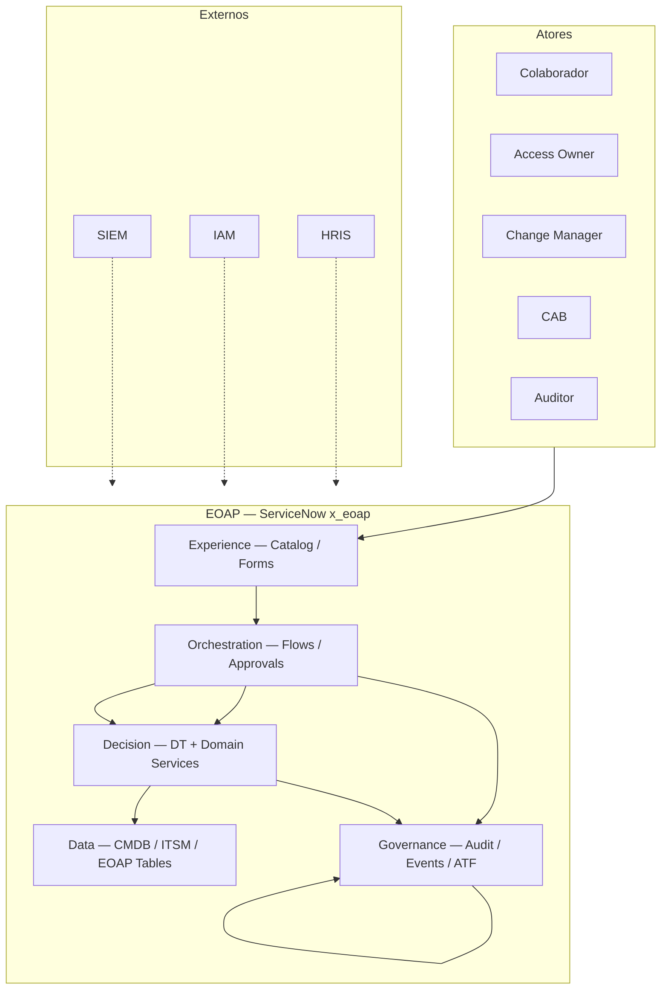
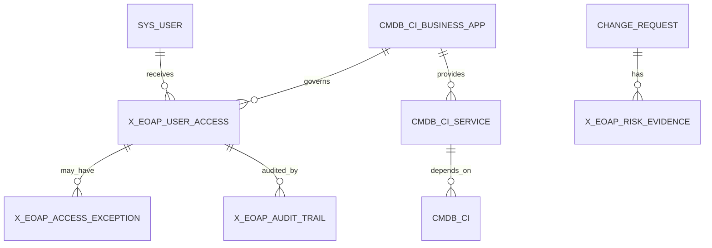
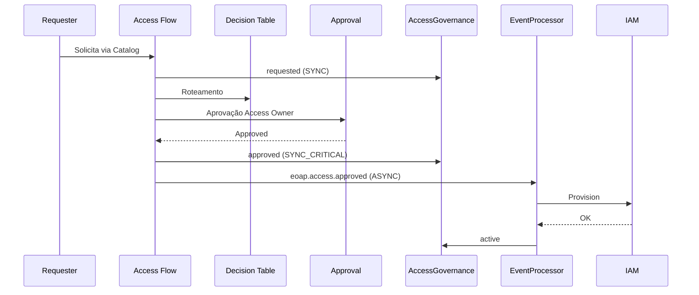
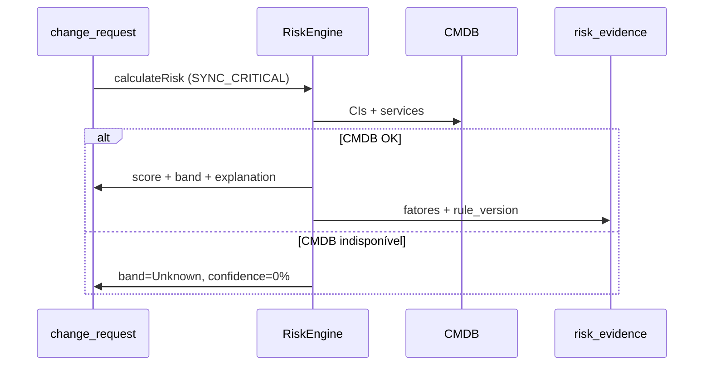

# EOAP — Enterprise Operations Automation Platform
## Architecture Document — Final Release

| Atributo | Valor |
| --- | --- |
| Solução | EOAP v3.0 |
| Plataforma | ServiceNow — Scoped Application `x_eoap` |
| Autor | Artur Campos Batista |
| Data | 2026-06-06 |
| Versão | 3.0 Final |
| Status | **Aprovado — Architecture Review Board** |
| Classificação | Confidencial — Enterprise / Portfólio Sênior |

---

## 1. Executive Summary

### Problema

Organizações enterprise com ServiceNow operam CMDB, lifecycle de colaboradores, governança de acesso e risco de mudança em silos. A CMDB funciona como inventário passivo. Acessos nascem em tickets sem lifecycle. Mudanças chegam ao CAB sem contexto de dependência. Evidências de decisão ficam dispersas em logs e aprovações isoladas.

**Impacto:** risco operacional elevado, acessos órfãos, falhas em auditoria SOX/ISO 27001, CAB sem base objetiva.

### Solução EOAP

A **EOAP (Enterprise Operations Automation Platform)** é uma camada de governança operacional sobre ServiceNow. Unifica quatro domínios sem substituir ITSM, CMDB, Catalog ou Security nativos:

| Pilar | Entrega |
| --- | --- |
| CMDB Foundation | Business Applications e Application Services governados (CSDM 5) |
| Employee Lifecycle | Joiner / mover / leaver com rastreabilidade end-to-end |
| Access Governance | Entitlements com owner, validade, recertificação e exceções controladas |
| Change Risk Guardian | Score explicável, versionado e defensável perante CAB |

**Princípios:** OOB First · Configuration over Code · Governance by ADR · Security by Design · Auditability by Design.

### Impacto de negócio

| Resultado | Evidência |
| --- | --- |
| Conformidade | Audit trail aplicacional 7 anos, imutável, correlacionado |
| Redução de risco | Least privilege, SoD, reconciliação governado vs. técnico |
| Eficiência operacional | Política em Decision Tables; orquestração em Flow Designer |
| Decisão de mudança objetiva | Risk score com decomposição por fator e `rule_version` |
| Maturidade arquitetural | 20 ADRs fechados, C4, STRIDE, capacity planning, SLOs |

A EOAP é implementável em PDI e escala para instâncias corporativas. Customização existe somente onde gap OOB foi avaliado e aprovado em ARB (ADR-019).

---

## 2. Architecture Overview

### Visão unificada

### Camadas — responsabilidades exclusivas

| Camada | Responsabilidade | Mecanismo |
| --- | --- | --- |
| Experience | Interação humana estruturada | Catalog, Record Producers, Forms |
| Orchestration | Processos, aprovações, tarefas | Flow Designer, Subflows, Approval Engine |
| Decision | Políticas e computação de domínio | Decision Tables, Script Includes (domínio único) |
| Data | Persistência OOB e governada | CMDB/CSDM, change_request, sys_user, tabelas EOAP |
| Governance | Evidência, eventos, testes, decisões | Audit Trail, Event Processing, ATF, ADR Catalog |

Política vive em Decision Tables. Orquestração vive em Flows. Código procedural justifica-se por ADR.

### Bounded contexts

| Domínio | Entidades | Comunicação |
| --- | --- | --- |
| CMDB | Business Application, Application Service (`cmdb_ci_service_auto` / `cmdb_ci_service_manual`) | Read-only para Access e Risk |
| Employee Lifecycle | sys_user, eventos joiner/mover/leaver | SYNC_CRITICAL revogação; ASYNC IAM |
| Access Governance | x_eoap_user_access, x_eoap_access_exception | Publica `eoap.access.*` |
| Risk | x_eoap_risk_evidence, campos EOAP em change_request | Cálculo síncrono on submit |

Script Includes não invocam cross-domain. Comunicação entre domínios = Subflow síncrono ou Event Processor assíncrono.

### System of Record

| Entidade | SoR | SoE | SoA |
| --- | --- | --- | --- |
| Employee | HRIS | ServiceNow | — |
| Identity técnica | IAM | Catalog | IAM |
| Business Application | CMDB | EOAP dashboards | — |
| Application Service | CMDB | EOAP views | — |
| Access Registry | EOAP | Catalog + Approvals | IAM |
| Change / Risk | ITSM + EOAP | Change form / CAB | — |
| Audit Evidence | EOAP | Relatórios auditoria | SIEM |

### Componentes implementáveis

| Tipo | Artefatos |
| --- | --- |
| Domain Services | EOAP_AccessGovernanceService, EOAP_RiskEngine, EOAP_AuditLogger, EOAP_EventProcessor, EOAP_CMDBQualityService |
| Decision Tables | DT_EOAP_Access_Approval_Routing, DT_EOAP_Risk_Weights, DT_EOAP_Risk_Banding, DT_EOAP_Lifecycle_Actions |
| Tabelas | x_eoap_user_access, x_eoap_access_exception, x_eoap_audit_trail, x_eoap_event_processing, x_eoap_risk_evidence |
| Staging | x_eoap_import_employee, x_eoap_import_access_recon |
| Flows | Employee Onboarding, Move, Offboarding, Access Request, Change Risk Assessment |
| Jobs | Access/Exception Expiration, Recertification, Reconciliation, Event Retry, CMDB Quality |
| Integração | Scripted REST `/api/x_eoap/v1/`, Import Sets, Outbound REST + Connection Aliases |

### Promoção de ambientes

| Gate | Critério |
| --- | --- |
| DEV → TEST | ATF 100%, ADRs Accepted |
| TEST → PROD | UAT assinado, load test 50% Ano 1, MFA ativo, CSDM ≥ 95% |
| Release | SemVer `eoap-v*`, DT snapshot Git, back-out plan |

---

## 3. Domain Model

### Entidades finais

**CSDM 5:** Application Service = `cmdb_ci_service_auto` ou `cmdb_ci_service_manual`. Discovery alimenta CMDB; não governa entitlement nem risco.

### Lifecycle — User Access (`x_eoap_user_access`)

| Estado | Gatilho |
| --- | --- |
| requested | Catalog / Lifecycle Flow |
| pending_approval | DT_EOAP_Access_Approval_Routing |
| approved | Approval Engine |
| active | Confirmação IAM |
| revoked | Offboarding SYNC / recertification fail / manual |
| expired | EOAP_Job_Access_Expiration |
| rejected | Approval Engine |

Recertificação: campos `recertification_date` e `recertification_status` no mesmo registro. Sem delete físico. Create = system/service only.

### Lifecycle — Access Exception

`requested → approved → active → expired | revoked` — obrigatório `valid_to`, `compensating_control`, `justification`.

### Lifecycle — Event Processing

`received → processing → processed | failed → retry_pending → processed | failed_final | ignored_duplicate`

### Extensões CMDB e Change

| Objeto | Campos EOAP |
| --- | --- |
| cmdb_ci_business_app | x_eoap_access_owner, x_eoap_data_classification, x_eoap_access_criticality |
| cmdb_ci_service_* | x_eoap_operational_tier |
| change_request | x_eoap_risk_score, x_eoap_risk_band, x_eoap_risk_explanation |

### Retenção

| Entidade | Operacional | Total |
| --- | --- | --- |
| x_eoap_audit_trail | 2 anos | 7 anos |
| x_eoap_event_processing | 90 dias | Arquivamento |
| x_eoap_user_access | Sem auto-purge | LGPD: expurgo por DPO |

---

## 4. Core Flows

### Provisionamento de acesso

### Governança — offboarding, reconciliação, recertificação

**Offboarding (SYNC_CRITICAL):** `eoap.employee.terminated` → revogação de todos os `active` em < 60s → audit imediato → `eoap.access.revoked` (ASYNC) → deprovision IAM.

**Reconciliação diária (03:00):** órfão técnico (IAM sem EOAP) → revogação + audit `unauthorized_drift_mitigation`; órfão governado (EOAP sem IAM) → reprovisionamento.

**Recertificação semanal:** Access Owner certifica ou revoga; revogação segue caminho SYNC_CRITICAL + ASYNC IAM.

**CMDB Quality diário:** completude apps críticas ≥ 95% para gate PROD.

### Change Risk — cálculo síncrono

CMDB indisponível = band **Unknown**, nunca Low. Incidente P2 automático.

### Auditoria e compliance

Toda decisão gera `x_eoap_audit_trail` via EOAP_AuditLogger: **quem** (actor), **o quê** (entity), **por quê** (payload_summary + rule_version), **correlação** (correlation_id). Write-only. Falha de audit → syslog + alerta Platform Owner; nunca silenciada.

### Event-driven flows — classificação

| Classificação | Exemplos | Mecanismo |
| --- | --- | --- |
| SYNC_CRITICAL | Revogação, commit aprovação, risk on submit | Subflow síncrono |
| ASYNC_INTEGRATION | Provisionamento IAM, ingest HRIS | sysevent + EventProcessor |
| ASYNC_NOTIFICATION | Alertas operacionais | Notification |

---

## 5. Decision Model

Todas as decisões estão **Accepted** em ARB.

| ADR | Decisão | Trade-off aceito |
| --- | --- | --- |
| 001 | CMDB como espinha dorsal | Exige disciplina de qualidade CMDB |
| 002 | Decision Tables antes de scripts | Governança de DT obrigatória |
| 003 | Scoped Application `x_eoap` | Configuração cross-scope Sprint 0 |
| 004 | Flow Designer como orquestração | Flows grandes → subflows |
| 005 | Catalog como entrada humana | Manutenção de variáveis |
| 006 | Audit Trail write-only | Volume → archiving |
| 007 | RBAC segregado (7 papéis) | Admin sem contains operacionais |
| 008 | Classificação em Business Application | Preenchimento obrigatório apps críticas |
| 009 | Access Owner ≠ owned_by | Manutenção por aplicação |
| 010 | Risk Engine 3 camadas; CMDB fail = Unknown | CAB manual em indisponibilidade |
| 011 | User Access Registry custom | Reconciliação diária com IAM |
| 012 | Híbrido SYNC/Async | Menos purismo EDA; conformidade imediata |
| 013 | Logging padronizado com correlation_id | Disciplina de implementação |
| 014 | Exceções formais com compensating control | Processo de aprovação adicional |
| 015 | CMDB Quality como pré-requisito | Esforço contínuo de dados |
| 016 | Retenção e archiving | Infraestrutura de archiving |
| 017 | Cross-Scope Access Policy | Testes ATF Sprint 0 |
| 018 | Indexing Strategy Sprint 0 | Overhead de escrita |
| 019 | OOB avaliado antes de custom (5 tabelas) | Customização justificada |
| 020 | Staging tables para integração | Tabelas adicionais de import |

**Racional técnico central:** ServiceNow OOB resolve orquestração, CMDB e ITSM. EOAP adiciona governança semântica — entitlement lifecycle, audit aplicacional, risk evidence e event control — onde OOB não modela o objeto de negócio.

---

## 6. Security & Governance Model

### RBAC

| Role | Escopo |
| --- | --- |
| x_eoap.admin | Metadados, monitoramento — sem contains operacionais |
| x_eoap.cmdb_manager | Campos EOAP em CMDB |
| x_eoap.access_owner | Aprovar/revogar acessos sob responsabilidade |
| x_eoap.change_manager | Risk, exceções de mudança |
| x_eoap.risk_analyst | Decision Tables de risco |
| x_eoap.auditor | Leitura audit trail e evidências |
| x_eoap.manager | Solicitar/validar acessos de equipe |

MFA obrigatório PROD: admin, risk_analyst.

### ACL

| Regra | Enforcement |
| --- | --- |
| Deny by default | Table + Field ACL |
| x_eoap_user_access.create | system/service only |
| x_eoap_user_access.delete | none |
| x_eoap_audit_trail | append-only (AuditLogger) |
| x_eoap_risk_* / change_request risk fields | RiskEngine only |
| UI Policy | UX only — nunca controle de segurança |

### SoD

Solicitante ≠ Aprovador · Access Owner ≠ Risk Analyst · Risk Analyst ≠ Change Manager · Operacional ≠ Auditor.

### STRIDE → controles

Spoofing → OAuth 2.0/SSO · Tampering → Field ACL + audit write-only · Repudiation → correlation_id · Information Disclosure → RBAC + field ACL · DoS → idempotência + archiving · Elevation → SoD + ATF negativo.

### Compliance

SOX/ISO 27001: audit 7 anos imutável. LGPD: sem auto-purge. API: TLS 1.2+, OAuth 2.0. Integração: Connection & Credential Aliases.

### Governança operacional

| Mecanismo | Cadência | Owner |
| --- | --- | --- |
| ADR review | Fim sprint | Platform Owner |
| CMDB quality | Semanal | CMDB Manager |
| Role review | Trimestral | Security Lead |
| DT change | ATF regressão | Risk Analyst |
| Capacity | Trimestral | Platform Owner |

**ATF:** 6 suites (CMDB, Lifecycle, Access, Risk, Security Negative, Events). Gate DEV→TEST: 100% pass.

**Runbooks:** EOAP-RUN-001 (DLQ), EOAP-RUN-002 (drift), EOAP-RUN-003 (CMDB gaps).

---

## 7. Event-Driven & Data Consistency

### Catálogo de eventos

| Evento | Criticidade | Padrão |
| --- | --- | --- |
| eoap.employee.terminated | Crítica | SYNC revogação + ASYNC IAM |
| eoap.access.approved / revoked | Alta | SYNC estado + ASYNC IAM |
| eoap.access.expired | Alta | Job → ASYNC |
| eoap.change.risk.calculated | Média | SYNC score; evento notificação |
| eoap.cmdb.quality.failed | Média | Notificação Platform Owner |
| eoap.event.failed | Alta | DLQ alert |

### Contrato

Envelope: `schema_version`, `event_name`, `event_id`, `correlation_id`, `idempotency_key`, `source`, `timestamp`, `payload`. Payloads complexos em staging record referenciado por `parm1` em sysevent.

### Idempotência

Chave `hash(entidade + event_name + bucket)` em `x_eoap_event_processing.idempotency_key` (unique). Duplicata → `ignored_duplicate`.

### Retry e DLQ

Transitório: 3× (30s, 90s, 300s). Lock: 5×. DLQ: `failed_final`. Retry job: 15 min. Reprocessamento: UI Action pós root cause.

### Consistência

| Modelo | Escopo |
| --- | --- |
| Strong | Aprovação, revogação, risk score on submit |
| Eventual | Provisionamento IAM, SIEM |

### Rastreabilidade

`X-Correlation-ID` → Flow → Script Include → sysevent → audit_trail → syslog. Formato: `[EOAP][Module][Entity][Correlation_ID][Outcome]`.

### SLOs

| Métrica | Target |
| --- | --- |
| Fluxos críticos sem falha não recuperável | 99,5%/mês |
| correlation_id eventos críticos | 100% |
| MTTR failed_final | < 8h |
| CMDB completeness apps críticas | ≥ 95% |
| Revogação offboarding | < 60s |

### Capacity (referência)

| Horizonte | user_access | audit_trail | Gate |
| --- | --- | --- | --- |
| Ano 1 | 10K | 500K | Load test 50% |
| Ano 3 | 50K | 2,5M | Archiving |
| Ano 5 | 150K | 7,5M | Revisão infra |

---

## 8. Final Architecture Summary

### Nível de maturidade

| Dimensão | Classificação |
| --- | --- |
| Arquitetura estrutural | Enterprise-grade |
| Governança (ADR) | Enterprise-grade |
| CSDM / CMDB | CSDM 5 |
| Segurança / compliance | Enterprise-grade |
| Observabilidade / SLOs | Enterprise-grade |
| Testabilidade (ATF) | Enterprise-grade |
| Integração | Enterprise-grade |

### Readiness para produção

| Contexto | Status |
| --- | --- |
| Architecture Review Board | **Aprovado** |
| CIO / CTO | **Pronto** |
| Implantação DEV → TEST → PROD | **Pronto** |
| Portfólio CSA / CAD / CIS / Solution Architect | **Pronto** |

### Impacto organizacional

CMDB passa a ativo de governança com ownership obrigatório. IAM opera em reconciliação diária com registro governado. CAB delibera com score objetivo. Compliance usa audit trail como evidência primária. Platform opera scoped app com governança por ADR e ATF.

### Justificativa de aprovação ARB

A EOAP v3.0 consolida quatro documentos fonte em arquitetura única, coerente e sem pendências. O desenho é plataforma de governança operacional — não scripts isolados. Decisões fechadas, trade-offs explícitos, domínio sem duplicação, segurança e auditoria por design, eventos onde agregam valor e execução síncrona onde conformidade exige.

**Veredito:** Aprovado para implantação enterprise Fortune 500 com gates de promoção definidos.

---

*EOAP Architecture v3.0 — Documento único consolidado. Aprovado em Architecture Review Board.*
