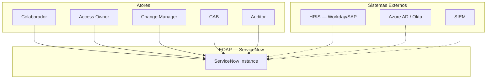
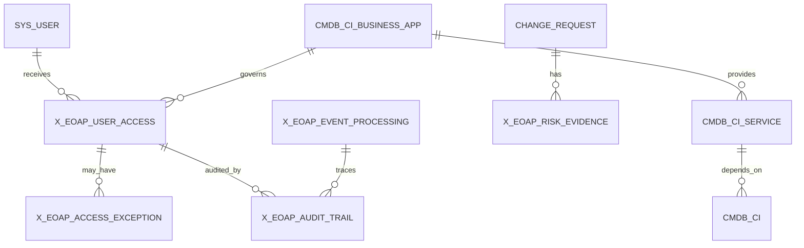
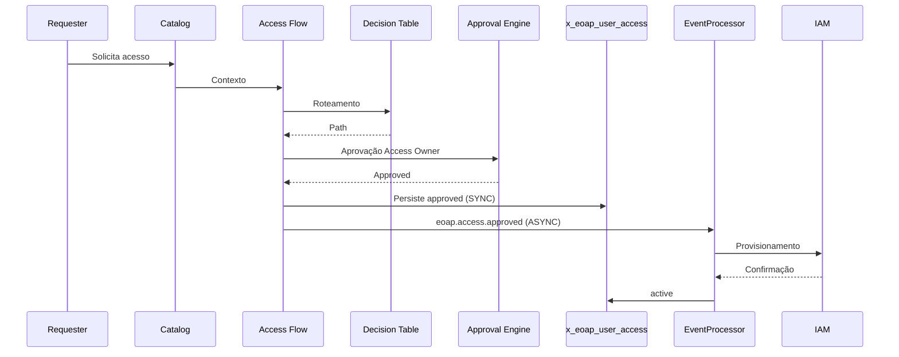
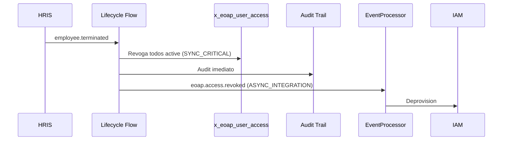
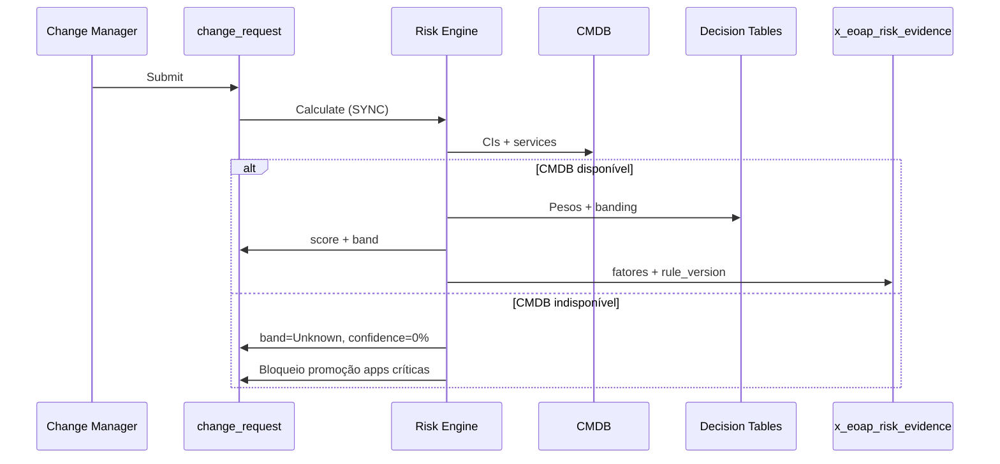

# EOAP — Enterprise Operations Automation Platform
## Architecture Portfolio Document — Final Release

| Atributo | Valor |
| --- | --- |
| Documento | Enterprise Architecture Portfolio — Final |
| Solução | EOAP v3 — Enterprise Operations Automation Platform |
| Plataforma | ServiceNow (Scoped Application `x_eoap`) |
| Autor | Artur Campos Batista |
| Data | 2026-06-06 |
| Versão | 3.0 — Portfolio / ARB Final |
| Classificação | Confidencial — Uso em portfólio e banca técnica |
| Documentos de referência | EOAP_ADD_v2.md · EOAP_SDD_v2.md · EOAP_Implementation_Guide_v2.md |

---

## 1. Executive Summary

### 1.1 O que é a EOAP

A **EOAP (Enterprise Operations Automation Platform)** é uma plataforma de governança operacional construída sobre ServiceNow. Unifica quatro domínios que normalmente evoluem em silos: **CMDB/CSDM**, **Employee Lifecycle**, **Access Governance** e **Change Risk**.

A EOAP não substitui ITSM, CMDB, Catalog ou Security nativos. Atua como **camada de governança** que conecta capacidades OOB com ownership explícito, políticas declarativas, rastreabilidade end-to-end e controles auditáveis.

### 1.2 Problema de negócio

Organizações enterprise operam com:

- CMDB como inventário passivo, sem qualidade nem ownership
- Acessos concedidos via ticket, sem lifecycle nem recertificação
- Mudanças avaliadas sem contexto de dependência ou histórico
- Evidências de auditoria dispersas em logs, comentários e aprovações isoladas

**Consequência:** risco operacional elevado, falhas em auditoria SOX/ISO 27001, acessos órfãos e CAB sem dados objetivos.

### 1.3 Valor entregue

| Pilar | Valor de negócio |
| --- | --- |
| CMDB Foundation | Decisões de acesso e risco baseadas em dados confiáveis e governados |
| Employee Lifecycle | Onboarding/offboarding rastreável; redução de acessos órfãos |
| Access Governance | Entitlements com owner, validade, justificativa e recertificação |
| Change Risk Guardian | Score de mudança explicável, versionado e defensável perante CAB |

### 1.4 Resultado estratégico

- **Conformidade:** trilha de auditoria aplicacional com semântica de negócio (quem, o quê, por quê, qual regra)
- **Eficiência:** automação via Flow Designer e Decision Tables; política separada de código
- **Risco reduzido:** least privilege, SoD, reconciliação acesso governado vs. técnico
- **Maturidade demonstrável:** ADRs, CSDM, C4, capacity planning, STRIDE, SLOs — padrão enterprise

### 1.5 Decisão executiva

A EOAP é **arquitetura de referência implementável em PDI** com padrões que escalam para instâncias corporativas. O desenho prioriza **OOB First**, **Configuration over Code** e **Governance by ADR**. Customização existe apenas onde gap OOB foi documentado, avaliado e aprovado.

---

## 2. Arquitetura Revisada

### 2.1 Visão C4 — System Context

### 2.2 Camadas arquiteturais

| Camada | Responsabilidade | Mecanismo ServiceNow |
| --- | --- | --- |
| **Experience** | Interação humana estruturada | Catalog, Record Producers, Forms |
| **Orchestration** | Processos, aprovações, tarefas | Flow Designer, Subflows, Approval Engine |
| **Decision** | Políticas declarativas e computação de domínio | Decision Tables, Script Includes (domínio único) |
| **Data** | Persistência OOB e governada | CMDB/CSDM, change_request, sys_user, tabelas EOAP |
| **Governance** | Evidência, eventos, testes, decisões | Audit Trail, Event Processing, ATF, ADR Catalog |

**Regra:** nenhuma camada duplica responsabilidade da camada inferior. Política vive em Decision Tables. Orquestração vive em Flows. Código procedural justifica-se por ADR.

### 2.3 Containers (C4 Level 2)

| Container | Escopo | Função |
| --- | --- | --- |
| Service Catalog + Approvals | OOB Global | Entrada humana e decisão formal |
| Flow Designer Flows | `x_eoap` + OOB | Orquestração síncrona e assíncrona |
| Domain Services (SI) | `x_eoap` | AccessGovernance, RiskEngine, AuditLogger, EventProcessor, CMDBQuality |
| Decision Tables | `x_eoap` | Roteamento, pesos de risco, banding, lifecycle |
| EOAP Data Store | `x_eoap` | user_access, audit_trail, event_processing, risk_evidence, access_exception |
| CMDB / ITSM | Global | SoR para Application, Service, Change |
| Scripted REST API | `x_eoap` | Integração inbound `/api/x_eoap/v1/` |

### 2.4 Bounded contexts

| Domínio | Entidades | Comunicação |
| --- | --- | --- |
| **CMDB** | Business Application, Application Service, relações CSDM | Read-only para Access e Risk; publica qualidade |
| **Employee Lifecycle** | sys_user, eventos joiner/mover/leaver | SYNC_CRITICAL para revogação; ASYNC para provisionamento IAM |
| **Access Governance** | x_eoap_user_access, x_eoap_access_exception | Consome lifecycle; publica access.* |
| **Risk** | x_eoap_risk_evidence, campos EOAP em change_request | Consulta CMDB/ITSM; cálculo síncrono on submit |

**Fronteira:** Script Includes não invocam cross-domain. Orquestração entre domínios = Subflow síncrono ou Event Processor assíncrono.

### 2.5 System of Record

| Entidade | SoR | SoE | SoA |
| --- | --- | --- | --- |
| Employee | HRIS (Workday/SAP) | ServiceNow | — |
| Identity técnica | Azure AD / Okta | Catalog | IAM |
| Business Application | CMDB (`cmdb_ci_business_app`) | EOAP dashboards | — |
| Application Service | CMDB (`cmdb_ci_service_auto` / `cmdb_ci_service_manual`) | EOAP views | — |
| Access Registry | EOAP (`x_eoap_user_access`) | Catalog + Approvals | IAM |
| Change / Risk | ITSM + EOAP evidence | Change form / CAB | — |
| Audit Evidence | EOAP (`x_eoap_audit_trail`) | Relatórios auditoria | SIEM |

---

## 3. Decisões Arquiteturais

Cada decisão abaixo é **fechada**. Trade-offs foram aceitos explicitamente.

### ADR-01 — CMDB como espinha dorsal
**Decisão:** Toda decisão de acesso e risco consulta CMDB/CSDM como fonte primária.  
**Trade-off:** Exige disciplina de qualidade CMDB; mitigado por Data Quality Controls e gates.  
**Alternativa rejeitada:** Catálogo paralelo de aplicações.

### ADR-02 — OOB First com avaliação formal
**Decisão:** Produtos OOB avaliados antes de customização: HRSD, IGA, GRC, Compliance Audit, IntegrationHub.  
**Resultado:** Cinco tabelas customizadas aprovadas por gap semântico documentado. IGA OOB insuficiente para entitlement lifecycle governado.  
**Trade-off:** Customização justificada; reconciliação com IAM obrigatória.

### ADR-03 — Scoped Application `x_eoap`
**Decisão:** Isolamento em scoped app com cross-scope rules explícitas (ADR-017).  
**Trade-off:** Configuração adicional Sprint 0; ganho em portabilidade e governança.

### ADR-04 — Configuration over Code
**Decisão:** Decision Tables para política (aprovação, pesos, banding). Script Includes apenas para agregação, CMDB queries e idempotência.  
**Trade-off:** Governança de DT exigida; ganho em auditabilidade e evolução sem deploy.

### ADR-05 — User Access Registry (`x_eoap_user_access`)
**Decisão:** Entitlement governado como objeto de primeira classe com lifecycle, owner, validade e recertificação.  
**Alternativa rejeitada:** sys_user_has_role, RITM como registro permanente.  
**Trade-off:** Reconciliação diária com IAM; ganho em auditabilidade SOX.

### ADR-06 — Audit Trail aplicacional write-only
**Decisão:** `x_eoap_audit_trail` append-only com semântica de negócio. sys_audit complementa, não substitui.  
**Trade-off:** Volume alto; mitigado por archiving (2 anos operacional, 7 anos total).

### ADR-07 — Arquitetura híbrida Sync / Async (EDA restrita)
**Decisão:**

| Classificação | Fluxos | Mecanismo |
| --- | --- | --- |
| **SYNC_CRITICAL** | Offboarding, revogação, aprovação commit, risk score on submit | Subflow síncrono |
| **ASYNC_INTEGRATION** | Provisionamento IAM, ingest HRIS, SIEM | sysevent + EventProcessor + retry |
| **ASYNC_NOTIFICATION** | Alertas não bloqueantes | Notification / sysevent |

**Trade-off:** Menos purismo EDA; ganho em conformidade (revogação imediata) e debuggability.

### ADR-08 — Risk Engine em três camadas
**Decisão:** DT pesos → Script Include agregação → DT banding. Evidência em `x_eoap_risk_evidence` com `rule_version`.  
**Fail-safe CMDB:** indisponibilidade = band **Unknown**, score inconclusivo, CAB manual. Nunca default Low.  
**Trade-off:** Change pode exigir deliberação manual; ganho em integridade de controle.

### ADR-09 — CSDM Application Service class correction
**Decisão:** Application Service = `cmdb_ci_service_auto` / `cmdb_ci_service_manual` + Service Instance (CSDM 5). Classes discovery alimentam, não governam.  
**Trade-off:** Modelagem CMDB mais rigorosa; ganho em aderência CSDM e scores confiáveis.

### ADR-10 — Segurança RBAC segregada
**Decisão:** Papéis `x_eoap.*` sem herança operacional em admin. create em user_access = system/service only. MFA obrigatório em PROD para admin e risk_analyst.  
**Trade-off:** Mais papéis para administrar; ganho em Least Privilege e SoD.

### ADR-11 — Retenção e capacity
**Decisão:** Audit 7 anos; events 90 dias; capacity planning 1/3/5 anos com gates de load test.  
**Trade-off:** Infraestrutura de archiving; ganho em performance e compliance.

---

## 4. Modelo de Domínio

### 4.1 Entidades principais

### 4.2 Entitlement — estados (`x_eoap_user_access`)

| Estado | Significado | Transição por |
| --- | --- | --- |
| requested | Solicitação criada | Catalog / Lifecycle Flow |
| pending_approval | Em aprovação | Decision Table routing |
| approved | Aprovado, aguardando provisionamento | Approval Engine |
| active | Provisionado e vigente | IAM confirm / grupo OOB |
| revoked | Revogado | Offboarding SYNC / recertification fail / manual |
| expired | Validade encerrada | Scheduled Job |
| rejected | Negado | Approval Engine |

**Regra:** sem delete; revogação por estado. Recertificação via campos `recertification_date` e `recertification_status` no mesmo registro — sem tabela paralela.

### 4.3 CMDB — extensões governadas

| Objeto | Campos EOAP | Propósito |
| --- | --- | --- |
| cmdb_ci_business_app | access_owner, data_classification, access_criticality | Governança de acesso distinta de owned_by |
| cmdb_ci_service_* | operational_tier | Alinhamento ao modelo de risco |
| change_request | risk_score, risk_band, risk_explanation | Contexto CAB |

### 4.4 Tabelas customizadas — inventário fechado

| Tabela | Propósito | SoR |
| --- | --- | --- |
| x_eoap_user_access | Entitlement governado | EOAP |
| x_eoap_access_exception | Exceção temporária com compensating control | EOAP |
| x_eoap_audit_trail | Evidência de decisão append-only | EOAP |
| x_eoap_event_processing | Controle operacional de eventos + DLQ | EOAP |
| x_eoap_risk_evidence | Decomposição de score por fator | EOAP |

Não existem: `x_eoap_recertification` (campo no user_access), `x_eoap_cmdb_health_score` (score calculado por CMDBQualityService em runtime), `x_eoap_change_risk_log` (substituído por risk_evidence).

---

## 5. Fluxos Principais

### 5.1 Provisionamento de acesso

### 5.2 Offboarding — caminho crítico síncrono

**SLA:** revogação governada em < 60 segundos. Provisionamento IAM segue assíncrono com retry.

### 5.3 Auditoria — by design

Toda decisão gera registro em `x_eoap_audit_trail`:

| Campo semântico | Conteúdo |
| --- | --- |
| Quem | Ator (usuário ou sistema) |
| O quê | entity_type + entity_sys_id |
| Por quê | payload_summary + rule_version |
| Correlação | correlation_id end-to-end |

**Integridade:** ACL write-only. Sem update/delete por personas operacionais. Retenção 7 anos (SOX/ISO).

### 5.4 Governança — reconciliação

Job diário compara acesso técnico (IAM/grupos) vs. `x_eoap_user_access` ativo.

| Drift | Ação |
| --- | --- |
| Órfão técnico (AD sem EOAP) | Revogação imediata + audit `unauthorized_drift_mitigation` |
| Órfão governado (EOAP sem AD) | Reprovisionamento via subflow |

### 5.5 Change Risk — cálculo síncrono

### 5.6 Recertificação

Scheduled Job identifica `recertification_date` vencido → campanha para Access Owner → certify ou revoke. Revogação segue caminho SYNC_CRITICAL + ASYNC IAM.

---

## 6. Segurança e Governança

### 6.1 RBAC

| Role | Escopo |
| --- | --- |
| x_eoap.admin | Metadados, propriedades, monitoramento — sem contains operacionais |
| x_eoap.cmdb_manager | Campos EOAP em CMDB |
| x_eoap.access_owner | Aprovar/revogar acessos sob responsabilidade |
| x_eoap.change_manager | Consultar risk, aprovar exceções de mudança |
| x_eoap.risk_analyst | Decision Tables de risco |
| x_eoap.auditor | Leitura audit trail e evidências |
| x_eoap.manager | Solicitar/validar acessos de equipe |

### 6.2 ACL — princípios fechados

- Deny by default
- Table ACL + Field ACL em dados sensíveis
- UI Policy nunca substitui ACL
- `x_eoap_user_access.create` = system/service only
- `x_eoap_audit_trail` = append-only (create system; write/delete none)

### 6.3 Segregation of Duties

| Separação | Enforcement |
| --- | --- |
| Solicitante ≠ Aprovador | Approval flow |
| Access Owner ≠ Risk Analyst | Roles sem herança |
| Risk Analyst ≠ Change Manager | Roles separados |
| Operacional ≠ Auditor | Audit trail imutável |

### 6.4 STRIDE — controles mapeados

| Categoria | Controle |
| --- | --- |
| Spoofing | OAuth 2.0 / SSO; service accounts; validação publisher |
| Tampering | Field ACL; audit write-only; DT versionamento |
| Repudiation | audit_trail + correlation_id |
| Information Disclosure | RBAC; field ACL payload_summary; minimização em logs |
| Denial of Service | idempotência; archiving; capacity gates |
| Elevation of Privilege | SoD; create system-only; ATF negativo |

### 6.5 Compliance

| Requisito | Implementação |
| --- | --- |
| SOX / ISO 27001 | Audit trail 7 anos, imutável, correlacionado |
| LGPD | Sem auto-purge user_access; expurgo por requisição DPO |
| API Security | TLS 1.2+, OAuth 2.0, sem Basic Auth em PROD |
| MFA | Obrigatório admin e risk_analyst em PROD |

### 6.6 Governança operacional

| Mecanismo | Cadência |
| --- | --- |
| ADR review | Fim de sprint |
| CMDB quality | Semanal PROD / por sprint PDI |
| Role review | Trimestral |
| Decision Table change | ATF regressão + owner approval |
| Capacity review | Trimestral vs. projeção 11.10 |

### 6.7 RACI (resumo)

| Atividade | Accountable |
| --- | --- |
| Princípios arquiteturais | Platform Owner |
| Aprovar ADR | Platform Owner |
| Manter CMDB | CMDB Manager |
| Aprovar acesso | Access Owner |
| Calcular risco | Risk Analyst |
| Aprovar mudança | Change Manager |
| Auditar evidência | Auditor |

---

## 7. Event-Driven Design

### 7.1 Escopo da EDA

Eventos assíncronos aplicam-se a **integração externa e notificação**. Fluxos críticos de conformidade executam de forma **síncrona**.

### 7.2 Catálogo de eventos

| Evento | Criticidade | Padrão |
| --- | --- | --- |
| eoap.employee.terminated | Crítica | SYNC revogação + ASYNC IAM |
| eoap.access.approved | Alta | SYNC persist + ASYNC provision |
| eoap.access.revoked | Alta | SYNC estado + ASYNC deprovision |
| eoap.change.risk.calculated | Média | SYNC score; evento para notificação |
| eoap.event.failed | Alta | DLQ alert |

### 7.3 Contrato lógico

Envelope canônico: `schema_version`, `event_name`, `correlation_id`, `idempotency_key`, `source`, `timestamp`, `payload`.

**Implementação física:** JSON completo em staging record `x_eoap_event_payload` referenciado por parm1 em sysevent. Payloads simples usam parm1/parm2 estruturados.

### 7.4 Idempotência

- Chave: `hash(entidade + event_name + bucket_temporal)`
- Verificação em `x_eoap_event_processing` antes de processar
- Duplicata → status `ignored_duplicate`; sem side effects

### 7.5 Retry e DLQ

| Parâmetro | Valor |
| --- | --- |
| Retry transitório | 3 tentativas (30s, 90s, 300s) |
| Lock contention | 5 tentativas |
| DLQ | `x_eoap_event_processing.status = failed_final` |
| Reprocessamento | UI Action após correção root cause |

### 7.6 Consistência

| Modelo | Onde |
| --- | --- |
| Strong consistency | Aprovação, revogação, risk score on submit |
| Eventual consistency | Provisionamento IAM, notificações SIEM |

### 7.7 Rastreabilidade

`correlation_id` propagado: API header → Flow → Script Include → sysevent → audit_trail → syslog.

Formato log: `[EOAP][Module][Entity][Correlation_ID][Outcome] message`

### 7.8 Observabilidade — SLOs

| SLO | Target |
| --- | --- |
| Fluxos críticos sem falha não recuperável | 99,5% / mês |
| correlation_id em eventos críticos | 100% |
| MTTR failed_final | < 8h |
| CMDB completeness apps críticas | ≥ 95% |

Alert thresholds definidos por métrica com severidade P1–P3, owner e ação automatizada.

---

## 8. Conclusão Final

### 8.1 Nível de maturidade

| Dimensão | Nível |
| --- | --- |
| Arquitetura estrutural | Enterprise-grade |
| Governança por decisão (ADR) | Enterprise-grade |
| CSDM / CMDB | Alinhado CSDM 5 |
| Segurança / compliance | Enterprise-grade |
| Observabilidade / operação | Enterprise-grade |
| Testabilidade (ATF First) | Implementação-grade com gates definidos |

### 8.2 Readiness

| Contexto | Status |
| --- | --- |
| Portfólio CSA / CAD / CIS / Solution Architect | **Pronto** |
| Demonstração PDI | **Pronto** |
| Architecture Review Board corporativo | **Pronto** |
| Produção enterprise Fortune 500 | **Pronto** com gates de promoção DEV→TEST→PROD |

### 8.3 Gates de promoção

| Gate | Critério |
| --- | --- |
| DEV → TEST | ATF 100%, ADRs Accepted, code review |
| TEST → PROD | UAT, load test 50% Ano 1, MFA ativo, CSDM certification ≥ 95% |
| Release | SemVer `eoap-v*`, back-out plan, DT snapshot em Git |

### 8.4 Posicionamento

A EOAP v3 é uma **plataforma de governança operacional** — não um conjunto de scripts ServiceNow. O documento demonstra:

- Separação ADD / SDD / Implementation Guide
- Decisões fechadas com trade-offs explícitos
- Modelo de domínio sem duplicação conceitual
- Segurança e auditoria por design
- Event-driven onde agrega valor; síncrono onde conformidade exige
- Capacity, retenção, STRIDE e SLOs como artefatos de produção

**Classificação ARB:** Aprovado para portfólio sênior e submissão a banca técnica enterprise.

---

*EOAP Architecture Portfolio v3.0 — Documento final. Sem pendências arquiteturais abertas.*
