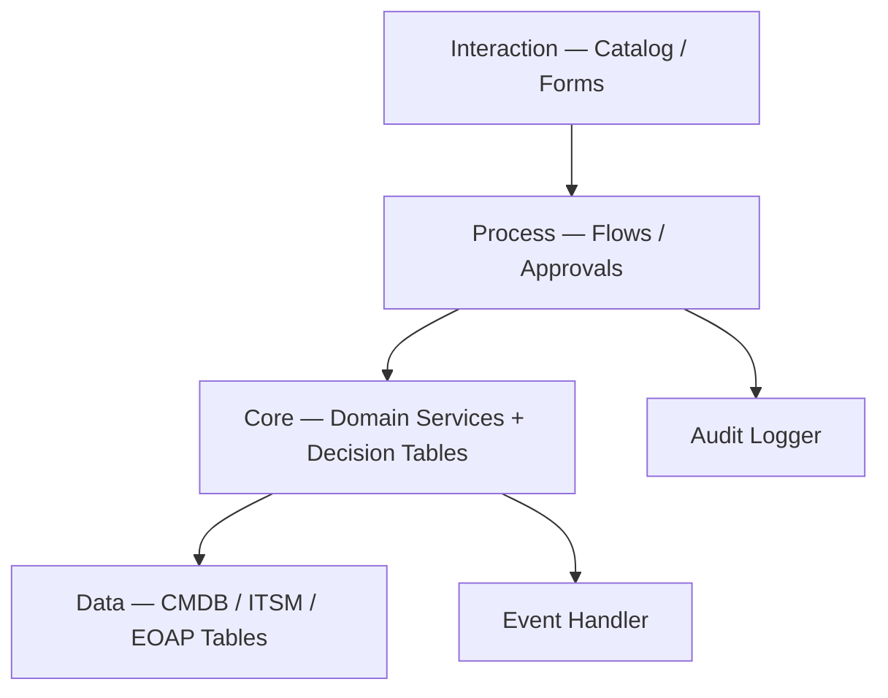
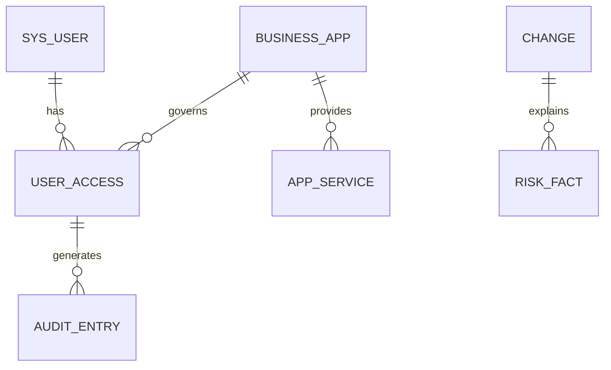
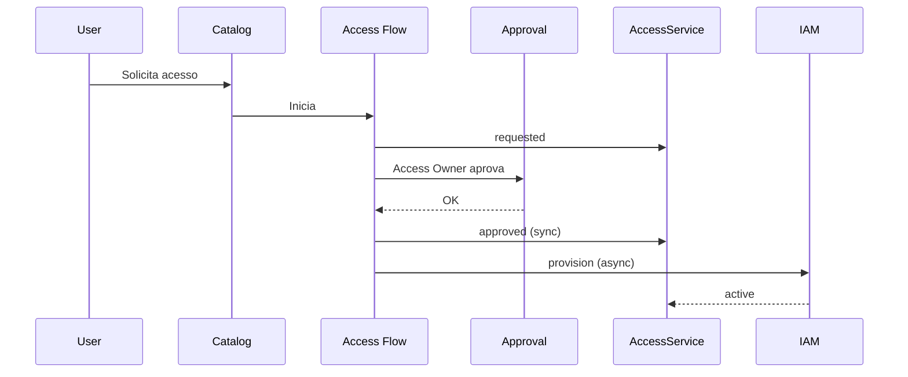
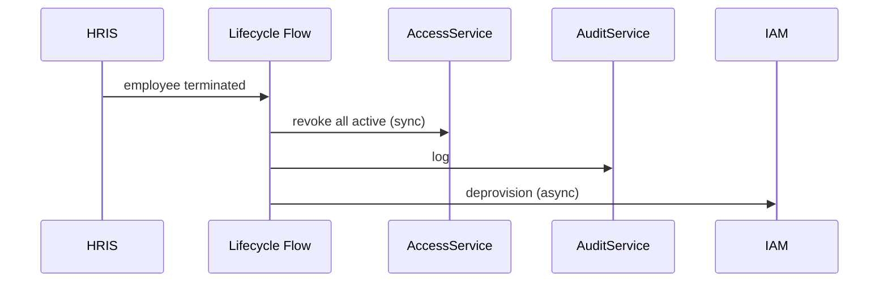

# EOAP Architecture v0 (Clean Design)

| Atributo | Valor |
| --- | --- |
| Solução | EOAP — Enterprise Operations Automation Platform |
| Plataforma | ServiceNow — Scoped Application `x_eoap` |
| Versão | v0 — Clean Start |
| Data | 2026-06-06 |
| Status | Design baseline |

---

## 1. Problem Definition

### O que a EOAP resolve

Empresas que usam ServiceNow para operar TI enfrentam quatro falhas estruturais:

1. **CMDB passiva** — aplicações e serviços existem, mas não sustentam decisões de acesso ou risco.
2. **Acesso sem lifecycle** — privilégios são concedidos via ticket e nunca revogados, recertificados ou reconciliados.
3. **Lifecycle desconectado** — entrada e saída de colaboradores não acionam concessão e revogação de forma rastreável.
4. **Mudança sem contexto** — o CAB avalia changes sem visão objetiva de impacto em serviços e aplicações.

**Consequência:** acessos órfãos, auditoria frágil, risco operacional e decisões baseadas em julgamento, não em dados.

### Contexto enterprise

A EOAP opera como **camada de governança** sobre capacidades nativas do ServiceNow (CMDB, Catalog, Change, Security). Não substitui ITSM nem CMDB. Conecta dados, processos e evidências em um modelo único, auditável e implementável em instância ServiceNow corporativa ou PDI.

---

## 2. Core Principles

| # | Princípio | Regra |
| --- | --- | --- |
| 1 | **CMDB First** | Toda decisão de acesso ou risco parte da CMDB. Sem catálogo paralelo de aplicações. |
| 2 | **Governed Entitlement** | Acesso é um objeto com owner, validade e estado — não um ticket descartável. |
| 3 | **Audit by Default** | Toda decisão relevante gera evidência imutável com contexto de negócio. |
| 4 | **Policy over Code** | Regras de roteamento e classificação vivem em configuração (Decision Tables, Flows), não em scripts dispersos. |
| 5 | **Sync when it matters** | Operações de conformidade (revogação, aprovação, score de risco) são síncronas. Integração externa é assíncrona. |

---

## 3. System Scope

### In scope

| Área | Entrega v0 |
| --- | --- |
| CMDB | Business Applications e Application Services com ownership e classificação mínima |
| Access | Solicitação, aprovação, provisionamento, revogação e expiração de acesso |
| Lifecycle | Onboarding e offboarding acionando concessão e revogação |
| Change Risk | Score de risco com explicação no submit da change |
| Audit | Trilha aplicacional write-only |
| Security | Papéis, ACLs e segregação básica de funções |

### Out of scope (v0)

| Área | Motivo |
| --- | --- |
| Integrações produtivas HRIS / IAM / SIEM | Interfaces preparadas; execução mock em PDI |
| IGA / GRC / HRSD licenciados | Avaliados; gap coberto por modelo mínimo custom |
| Discovery / Service Mapping real | CMDB alimentada manualmente ou por import controlado |
| Portal customizado, Domain Separation, multi-region | Complexidade sem valor no baseline |
| Recertificação em campanha completa | Campo e job básico; expansão posterior se necessário |

### Boundary

```
[ HRIS ] ──► [ ServiceNow + EOAP ] ──► [ IAM ]
                  │
                  ├── CMDB (SoR apps/services)
                  ├── EOAP (SoR entitlements + audit)
                  └── ITSM (SoR changes)
```

EOAP não executa identidade. EOAP governa **o que** deve existir; IAM executa **como** provisionar.

---

## 4. Clean Architecture Model

### Camadas (4)



| Camada | Responsabilidade | Não faz |
| --- | --- | --- |
| **Interaction** | Entrada humana estruturada | Lógica de negócio |
| **Process** | Orquestração e aprovações | Cálculo de risco ou persistência direta |
| **Core** | Regras, lifecycle de acesso, risk score, audit | UI ou integração HTTP direta |
| **Data** | Persistência CMDB, change_request, tabelas EOAP | Política de aprovação |

### Componentes Core (5)

| Componente | Função |
| --- | --- |
| `AccessService` | Criar, aprovar, revogar, expirar acessos |
| `RiskService` | Calcular score e banda de change |
| `AuditService` | Registrar evidência write-only |
| `EventHandler` | Publicar/consumir eventos com idempotência |
| `CMDBValidator` | Validar completude mínima antes de decisões críticas |

### Integração

- **Inbound:** Catalog, Import Set (HRIS mock)
- **Outbound:** sysevent → IAM mock (provision/revoke)
- **API:** reservada; não obrigatória no v0

---

## 5. Domain Model

### Entidades essenciais



### Tabelas EOAP (3)

| Tabela | Propósito |
| --- | --- |
| `x_eoap_user_access` | Registro governado de entitlement |
| `x_eoap_audit_trail` | Evidência de decisão (append-only) |
| `x_eoap_risk_evidence` | Fatores que compõem o score de uma change |

**Extensões CMDB:** `access_owner`, `data_classification` em `cmdb_ci_business_app`.  
**Extensões Change:** `risk_score`, `risk_band`, `risk_explanation` em `change_request`.

Application Service = `cmdb_ci_service_auto` ou `cmdb_ci_service_manual` (CSDM).

### Lifecycle — User Access

```
requested → pending_approval → approved → active → revoked | expired | rejected
```

| Regra | Decisão |
| --- | --- |
| Criação | Somente via Flow (system context) |
| Delete | Proibido |
| Revogação offboarding | Síncrona, todos os `active` |
| Expiração | Job diário em `valid_to` |

---

## 6. Core Flows

### Provisioning



### Governance — offboarding



**SLA v0:** revogação governada < 60 segundos.

### Governance — reconciliação

Job diário: compara acesso técnico (grupo/IAM) vs. `x_eoap_user_access` ativo.

| Situação | Ação |
| --- | --- |
| Técnico sem registro EOAP | Revogar + auditar |
| EOAP sem técnico | Reprovisionar |

### Change Risk

No submit da change: `RiskService` consulta CIs → aplica pesos → grava score, band, explanation e fatores em `x_eoap_risk_evidence`.

| Cenário | Comportamento |
| --- | --- |
| CMDB disponível | Score calculado normalmente |
| CMDB indisponível | Band = `unknown`; CAB decide manualmente |

### Audit

Toda transição de estado e toda decisão de aprovação/rejeição/risco gera registro em `x_eoap_audit_trail`:

- **Quem** — ator
- **O quê** — entidade + ação
- **Quando** — timestamp
- **Correlação** — `correlation_id` único por transação

---

## 7. Event & Data Strategy

### Quando usar eventos

Eventos existem para **desacoplar integração externa**. Não substituem operações síncronas de conformidade.

| Operação | Modo |
| --- | --- |
| Revogação, aprovação commit, risk on submit | Síncrono |
| Provisionamento IAM, ingest HRIS | Assíncrono (sysevent) |

### Eventos v0 (4)

| Evento | Quando |
| --- | --- |
| `eoap.access.approved` | Após aprovação; dispara provisionamento |
| `eoap.access.revoked` | Após revogação; dispara deprovision |
| `eoap.employee.terminated` | Inicia offboarding |
| `eoap.change.risk.calculated` | Após cálculo de risco |

### Idempotência

Chave por evento + entidade. Reprocessamento duplicado é ignorado sem efeito colateral.

### Retry

3 tentativas com backoff para falha transitória. Após limite: status `failed` + tarefa ao administrador.

### Retenção

| Dado | Período |
| --- | --- |
| Audit trail | 7 anos |
| Risk evidence | Vida da change + 1 ano |
| Event log operacional | 90 dias |

---

## 8. Security & Governance

### RBAC (5 papéis)

| Papel | Função |
| --- | --- |
| `x_eoap.admin` | Configuração e monitoramento |
| `x_eoap.access_owner` | Aprovar e revogar acessos da sua aplicação |
| `x_eoap.change_manager` | Operar changes e consultar risco |
| `x_eoap.auditor` | Leitura de audit trail |
| `x_eoap.user` | Solicitar acesso via catalog |

### ACL — regras base

- Deny by default
- `x_eoap_user_access.create` — system/flow only
- `x_eoap_audit_trail` — append-only; sem update/delete
- Risk fields em change — somente RiskService escreve

### Segregation of Duties

- Solicitante não aprova o próprio pedido
- Auditor não altera registros operacionais

### Compliance mínimo

- SOX/ISO: audit trail imutável e correlacionado
- API (quando existir): OAuth 2.0, TLS 1.2+

---

## 9. Final Statement

### Quando o sistema está pronto (v0)

| Critério | Evidência |
| --- | --- |
| Acesso solicitado, aprovado e provisionado | Flow end-to-end funcional |
| Offboarding revoga todos os acessos em < 60s | Teste com usuário e N acessos ativos |
| Change recebe score com explicação | Submit gera risk_evidence |
| Toda decisão tem audit trail | Registro correlacionado por `correlation_id` |
| ACLs bloqueiam acesso indevido | Testes negativos básicos |
| CMDB crítica tem owner e classificação | Validator retorna OK |

### Definição de sucesso

A EOAP v0 está pronta quando uma organização consegue:

1. Governar acessos como entidades com lifecycle completo.
2. Revogar acessos automaticamente no desligamento.
3. Avaliar risco de mudança com base em CMDB.
4. Demonstrar a auditores **quem decidiu, o quê e por quê**.

### O que v0 não precisa ser

Não precisa de 20 ADRs, 6 suites ATF, capacity planning de 5 anos, STRIDE formal ou integrações produtivas. Precisa ser **correto, simples e extensível**.

A complexidade adicional entra somente quando um requisito real exige — com decisão documentada, não por acúmulo de versões.

---

*EOAP Architecture v0 — Clean Design. Baseline sem legado.*
